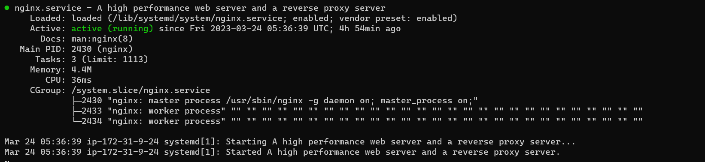
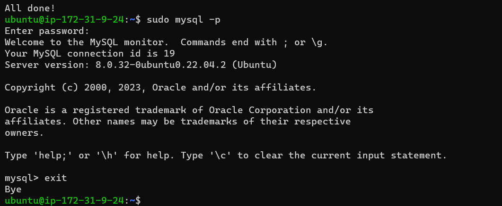
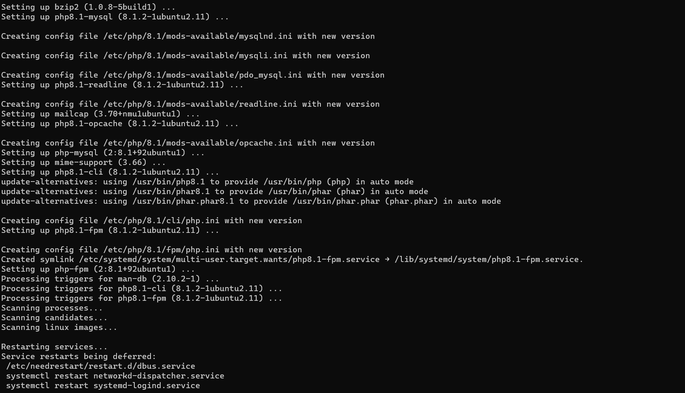
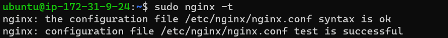
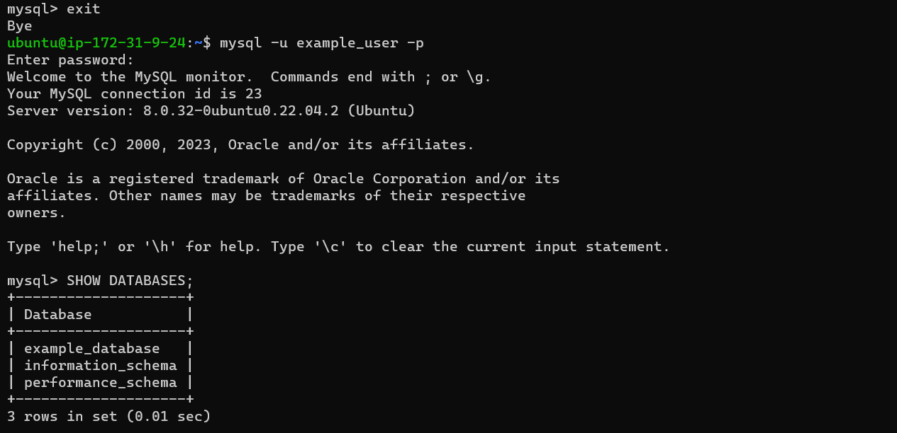
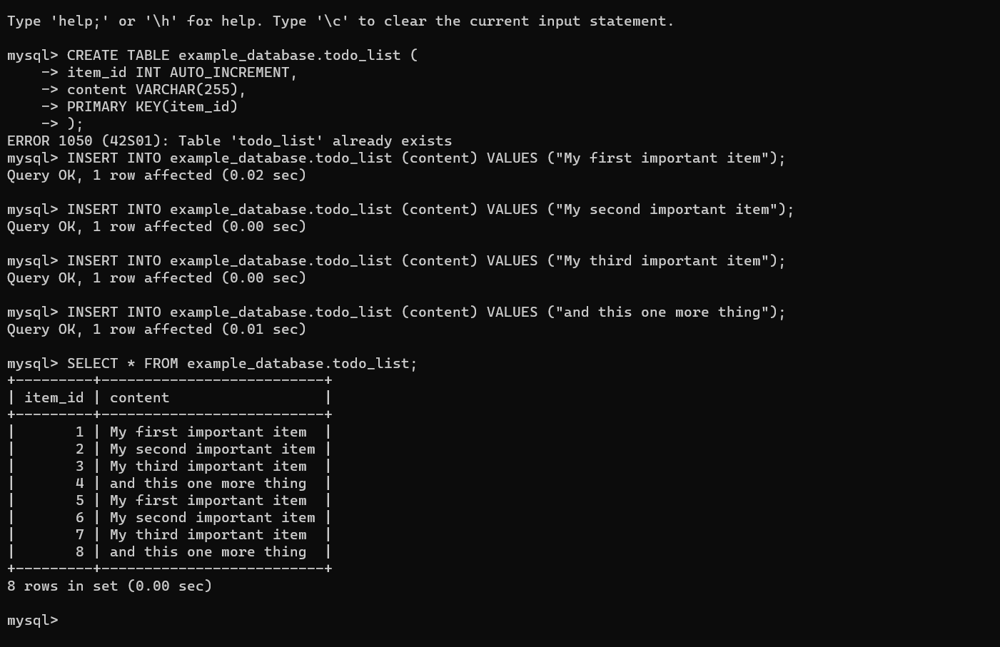

# DOCUMENTATION ON LEMP STACK IMPLEMENTATION

## INSTALLING THE NGINX WEB SERVER

`sudo apt update`

`sudo apt install nginx`

`sudo systemctl status nginx`

`curl http://127.0.0.1:80`

`curl -s http://169.254.169.254/latest/meta-data/public-ipv4`

[welcome to nginx](http://16.170.165.17/)

## INSTALLING MYSQL

`sudo apt install mysql-server`

`sudo mysql`

`mysql> ALTER USER 'root'@'localhost' IDENTIFIED WITH mysql_native_password BY 'PassWord.1';`

`mysql> exit`

`sudo mysql_secure_installation`

`sudo mysql -p`

`mysql> exit`

## INSTALLING PHP

`sudo apt install php-fpm php-mysql`

## CONFIGURING NGINX TO USE PHP PROCESSOR

`sudo mkdir /var/www/projectLEMP`
    	
`sudo chown -R $USER:$USER /var/www/projectLEMP`

`sudo nano /etc/nginx/sites-available/projectLEMP`

`#/etc/nginx/sites-available/projectLEMP

server {
    listen 80;
    server_name projectLEMP www.projectLEMP;
    root /var/www/projectLEMP;

    index index.html index.htm index.php;

    location / {
        try_files $uri $uri/ =404;
    }

    location ~ \.php$ {
        include snippets/fastcgi-php.conf;
        fastcgi_pass unix:/var/run/php/php8.1-fpm.sock;
     }

    location ~ /\.ht {
        deny all;
    }

}`
`sudo ln -s /etc/nginx/sites-available/projectLEMP /etc/nginx/sites-enabled/`

`sudo nginx -t`

`sudo unlink /etc/nginx/sites-enabled/default`

`sudo systemctl reload nginx`

`sudo echo 'Hello LEMP from hostname' $(curl -s http://169.254.169.254/latest/meta-data/public-hostname) 'with public IP' $(curl -s http://169.254.169.254/latest/meta-data/public-ipv4) > /var/www/projectLEMP/index.html`

[testing new server block](http://16.170.165.17/)

[testing new server block using public DNS name](http://ec2-16-170-165-17.eu-north-1.compute.amazonaws.com/)

## TESTING PHP WITH NGINX

`sudo nano /var/www/projectLEMP/info.php`

`<?php
phpinfo();`

[accessing page in web browser](http://ec2-16-170-165-17.eu-north-1.compute.amazonaws.com/info.php)

`sudo rm /var/www/your_domain/info.php`

##  RETRIEVING DATA FROM MYSQL DATABASE WITH PHP (CONTINUED)

`sudo mysql`

`mysql> CREATE DATABASE `example_database`;`

`mysql> GRANT ALL ON example_database.* TO 'example_user'@'%';`

`mysql> exit`

`mysql -u example_user -p`

`mysql> SHOW DATABASES;`

`CREATE TABLE example_database.todo_list (
mysql>     item_id INT AUTO_INCREMENT,
mysql>     content VARCHAR(255),
mysql>     PRIMARY KEY(item_id)
mysql> );`

`mysql> INSERT INTO example_database.todo_list (content) VALUES ("My first important item");`

`mysql>  SELECT * FROM example_database.todo_list;`

`mysql> exit`

`nano /var/www/projectLEMP/todo_list.php`

`<?php
$user = "example_user";
$password = "password";
$database = "example_database";
$table = "todo_list";

try {
  $db = new PDO("mysql:host=localhost;dbname=$database", $user, $password);
  echo "<h2>TODO</h2><ol>";
  foreach($db->query("SELECT content FROM $table") as $row) {
    echo "<li>" . $row['content'] . "</li>";
  }
  echo "</ol>";
} catch (PDOException $e) {
    print "Error!: " . $e->getMessage() . " ";
    die();
}`

[accessing page in browser](http://16.170.165.17/todo_list.php)
    